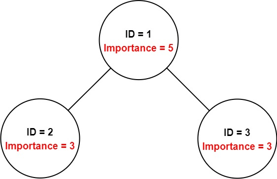
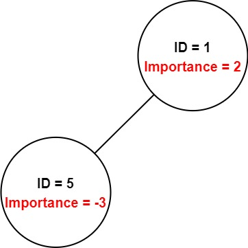

**You have a data structure of employee information, including the employee's unique ID, importance value, and direct subordinates' IDs.**
```swift
You are given an array of employees employees where:

employees[i].id is the ID of the ith employee.
employees[i].importance is the importance value of the ith employee.
employees[i].subordinates is a list of the IDs of the direct subordinates of the ith employee.
Given an integer id that represents an employee's ID, return the total importance value of this employee and all their direct and
indirect subordinates.
```

**Example 1:**



```swift
Input: employees = [[1,5,[2,3]],[2,3,[]],[3,3,[]]], id = 1
Output: 11
Explanation: Employee 1 has an importance value of 5 and has two direct subordinates: employee 2 and employee 3.
They both have an importance value of 3.
Thus, the total importance value of employee 1 is 5 + 3 + 3 = 11.
```

**Example 2:**



```swift
Input: employees = [[1,2,[5]],[5,-3,[]]], id = 5
Output: -3
Explanation: Employee 5 has an importance value of -3 and has no direct subordinates.
Thus, the total importance value of employee 5 is -3.
```

**Constraints:**
```swift
1 <= employees.length <= 2000
1 <= employees[i].id <= 2000
All employees[i].id are unique.
-100 <= employees[i].importance <= 100
One employee has at most one direct leader and may have several subordinates.
The IDs in employees[i].subordinates are valid IDs.
```

**Solution**
```swift
/**
 * Definition for Employee.
 * public class Employee {
 *     public var id: Int
 *     public var importance: Int
 *     public var subordinates: [Int]
 *     public init(_ id: Int, _ importance: Int, _ subordinates: [Int]) {
 *         self.id = id
 *         self.importance = importance
 *         self.subordinates = subordinates
 *     }
 * }
 */

class Solution {
    func getImportance(_ employees: [Employee], _ id: Int) -> Int {
        var map: [Int: Employee] = [Int: Employee]()
        for emp in employees {
            map[emp.id] = emp
        }

        func dfs(_ id: Int) -> Int {
            guard let emp = map[id] else {return 0}
            var total = emp.importance
            for subId in emp.subordinates {
                total += dfs(subId)
            }
            return total
        }
        //
        return dfs(id)
    }
}
```
