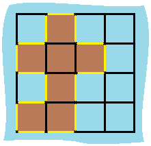

```swift
You are given row x col grid representing a map where grid[i][j] = 1 represents land and grid[i][j] = 0 represents water.

Grid cells are connected horizontally/vertically (not diagonally). The grid is completely surrounded by water, and there is exactly one island (i.e., one or more connected land cells).

The island doesn't have "lakes", meaning the water inside isn't connected to the water around the island. One cell is a square with side length 1. The grid is rectangular, width and height don't exceed 100. Determine the perimeter of the island.
```
 https://leetcode.com/problems/island-perimeter/description/

**Example 1:**


```swift
Input: grid = [[0,1,0,0],[1,1,1,0],[0,1,0,0],[1,1,0,0]]
Output: 16
Explanation: The perimeter is the 16 yellow stripes in the image above.
```
**Example 2:**

```swift
Input: grid = [[1]]
Output: 4
```
**Example 3:**
```swift
Input: grid = [[1,0]]
Output: 4
```

**Constraints:**
```swift
row == grid.length
col == grid[i].length
1 <= row, col <= 100
grid[i][j] is 0 or 1.
There is exactly one island in grid.
```

**Solution**

```swift
class Solution {
    func islandPerimeter(_ grid: [[Int]]) -> Int {
        //
        var grid = grid
        var rows = grid.count
        var cols = grid[0].count
        func dfs(_ i: Int, _ j: Int) -> Int {
            if i < 0 || j < 0 || i >= rows || j >= cols || grid[i][j] == 0 {
                return 1
            }
            if grid[i][j] == -1 {
                return 0
            }
            grid[i][j] = -1
            //
            return (dfs(i - 1, j) + dfs(i + 1, j) + dfs(i , j - 1) + dfs(i, j + 1)) 
        }
        for i in 0..<rows {
            for j in 0..<cols {
                if grid[i][j] == 1 {
                    return dfs(i , j)
                }
            }
        }
        return 0
    }
}
```
