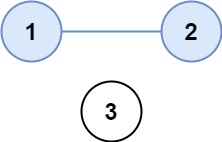

```swift
There are n cities. Some of them are connected, while some are not.
If city a is connected directly with city b, and city b is connected directly with city c, then city a is connected indirectly with city c.
A province is a group of directly or indirectly connected cities and no other cities outside of the group.
You are given an n x n matrix isConnected where isConnected[i][j] = 1 if the ith city and the jth city are directly connected,
and isConnected[i][j] = 0 otherwise.
Return the total number of provinces.
```


https://leetcode.com/problems/number-of-provinces/submissions/1984478876/
**Example 1:**



```swift
Input: isConnected = [[1,1,0],[1,1,0],[0,0,1]]
Output: 2
```

**Example 2:**


```swift
Input: isConnected = [[1,0,0],[0,1,0],[0,0,1]]
Output: 3
```

**Constraints:**
```swift
1 <= n <= 200
n == isConnected.length
n == isConnected[i].length
isConnected[i][j] is 1 or 0.
isConnected[i][i] == 1
isConnected[i][j] == isConnected[j][i]
```

**Solution**

```swift
class Solution {
    func findCircleNum(_ isConnected: [[Int]]) -> Int {
        //
        let n = isConnected.count
        var visited = Array(repeating: false, count: n)
        var provinces: Int = 0
        func dfs(_ city: Int) {
            for neibour in 0..<n {
                if isConnected[city][neibour] == 1 && !visited[neibour] {
                    visited[neibour] = true
                    dfs(neibour)
                }
            }
        }
        for i in 0..<n {
            if !visited[i] {
                provinces += 1
                visited[i] = true
                dfs(i)
            }
        }
        return provinces
    }
}
```
